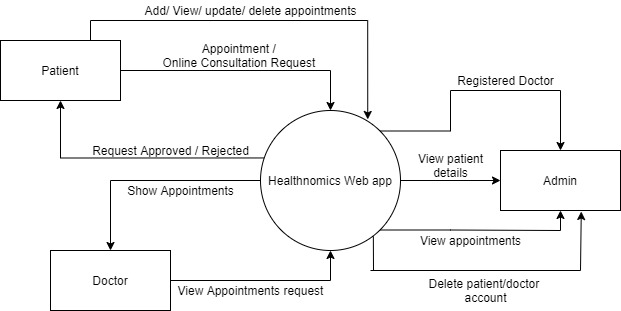
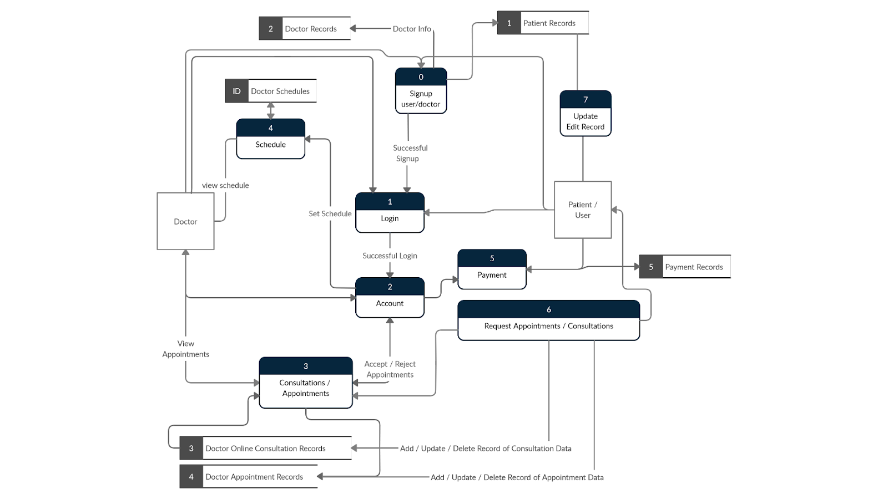
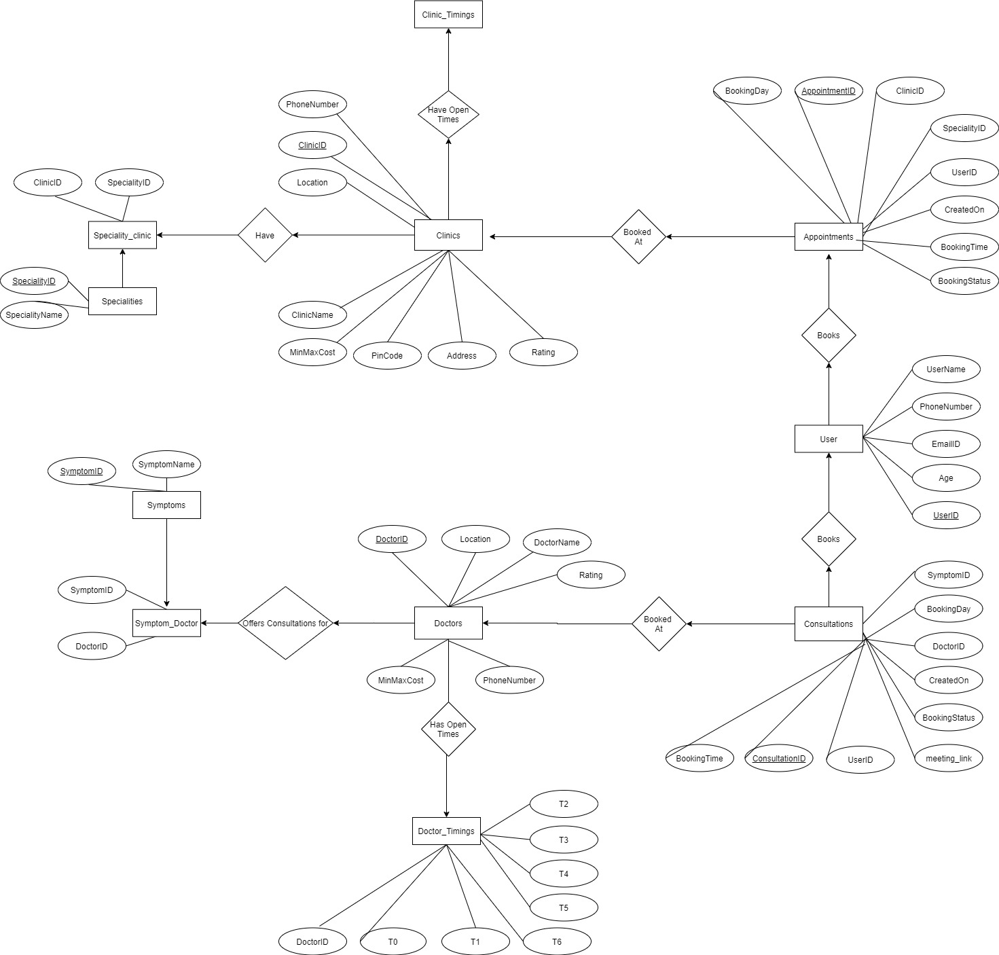
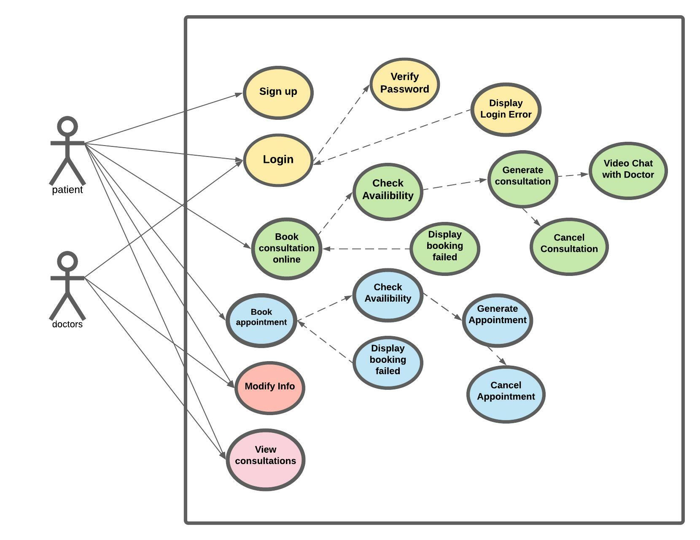

# HealthNomics - Practo Clone

          

# About

The main objective of this project is to develop a website for a medical clinic to provide an efficient and economical way of making appointments and help in all the related tasks: clinic and doctor time table management, queue management, and patient appointments exportation. It is wanted that patients have fast and easy access to the clinic’s services and administer all the appointments made. Meanwhile, it is also required that doctors can easily see all the upcoming appointments and give the results of these appointments to the patients.

# Limitations

There are some limitations to the system. They are:

- Admin has to delete unnecessary accounts manually.
- No implementation of the online pharmacy.
- Only a web-application has been built.
- Due to a lack of data, the recommendation system has not been implemented.

# Functional Requirements

1.  Patients can register / log in to the web application and can:

    - Book an appointment/doctor consultation online.
    - Video consultation with Doctors.
    - Hassle-free payments for the booked services.

2.  Doctors can log in to the web application and can:

    - Accept appointments
    - View Appointments

3.  The system should be giving minimal and relevant data only to the users.

# DFDs

1. Level 0

2. Level 1

# Entity-Relationship Diagram

# Use Case diagram

## Use Case Flow

### 1. Register User

- Preconditions: None
- Main flow:
  1.  The use case starts when a user indicates that he wants to register.
  2.  The system requests a name, email, phone, and password.
  3.  The user enters a name, email, phone, and password.
  4.  On user click/enter action, the server checks if this user is already registered.
  5.  If yes, an error message is thrown.
  6.  If no,then the user is registered successfully and the system starts a login session and displays the welcome page.
- Alternative Flows:
  1.  If the email already exists, then the system displays a message and the use case goes back to step 2.
  2.  If the user does not enter a required field, a message is displayed and the use case repeats step 3.

### 2. Login User

- Preconditions: The user is registered.
- Main flow:
  1.  The use case starts when a user indicates that he wants to login.
  2.  The system requests the email and password.
  3.  The user enters email and password.
  4.  The system verifies the id, email and password against all registered users.
  5.  The system starts a login session.
- Alternative Flows
  1.  If the username is invalid, the use case goes back to step 2.
  2.  If the password is invalid the system requests that the user re-enter the password. When the user enters another password the use case continues with step 4 using the original username and new password.

### 3. Search Appointments and Consultations

- Preconditions: The user needs to be registered and Logged In.
- Main Flow:
  1.  User heads to the home page where he can search for Booking Physical Appointments or Online Chat and Video Consultations under two different tabs.
  2.  The User is First prompted to enter his Location (City).
  3.  The search can be executed by clicking on common predefined Symptoms for Consultations and Specialities for Bookings or can search for Clinics / Doctors / Symptoms / Specialities through the search bar.
  4.  A list of most relevant responses is Outputted which the user can click and book appointments, consultations.

### 4 Book Appointment

- Preconditions: The user needs to be registered, Logged in and the User should have provided the Location in the initial prompt.

- Main Flow:
  1.  The user has two choices for which kind of appointment he wants.
  2.  The user either clicks ‘Consult Doctors’ or ‘Book appointment’
  3.  The user is then redirected to the ‘consult doctors’ page.
  4.  Users are asked to enter the date and time of appointment.
  5.  Users are then prompted to the payment gateway for successful completion of the booking.
  6.  Now the user has successfully booked the appointment.
